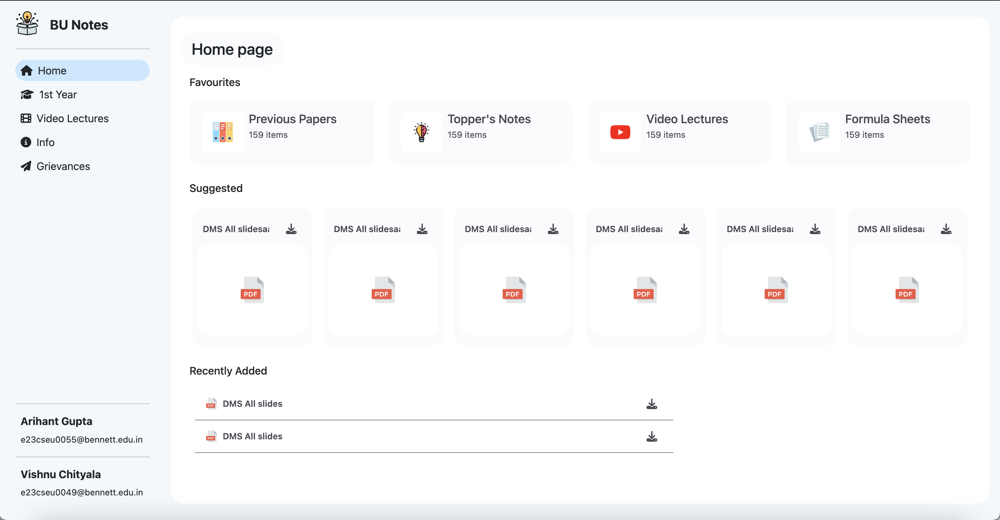

</img>

BU-Notes: Open Source Contribution for Hacktoberfest!
-----------------------------------------------------

Welcome to BU-Notes, your one-stop platform for first-year BTech CSE students at Bennett University! This repository is participating in Hacktoberfest 2024, an open-source event encouraging new contributors.

This project aims to build a frontend for the BU-Notes website using HTML, CSS, and JavaScript with the Bootstrap framework. Inspired by Google Drive, BU-Notes will offer a user-friendly interface to access and manage academic resources.

Calling All Beginner Developers at Bennett University!

If you have basic knowledge of HTML, CSS, and JavaScript, we invite you to contribute to this project and gain valuable open-source experience during Hacktoberfest!

Hacktoberfest Participation
---------------------------

This repository is designed to be friendly for beginners and welcomes contributions throughout Hacktoberfest. Here's how you can get involved:

1\. Clone this repository:

Bash

```
git clone [https://github.com/your-username/BU-Notes.git](https://github.com/your-username/BU-Notes.git)

```

Replace `your-username` with your actual GitHub username.

2\. Switch to the Hacktoberfest branch:

Bash

```
git checkout hacktoberfest

```

3\. Choose an issue: Look for open issues labeled "Hacktoberfest" that pique your interest. These issues are tailored for beginner contributions.

4\. Make changes and submit a pull request: Follow the detailed contribution guidelines below to ensure a smooth pull request process.

Contribution Guidelines
-----------------------

We appreciate your contributions! To streamline our development process, please adhere to the following steps:

1.  Make your changes: Edit files directly in your `hacktoberfest` branch.

2.  Commit your changes:

    Bash

    ```
    git commit -m "Add your descriptive message"

    ```

3.  Push your changes to your branch:

    Bash

    ```
    git push origin hacktoberfest

    ```

4.  Create a pull request from your `hacktoberfest` branch to the main branch of the original repository. Provide a well-written description of your contribution in the pull request. Here's how to create a pull request:

    -   Navigate to the main repository on GitHub.
    -   Click the "Compare & pull request" button.
    -   Ensure the base branch is set to the main branch of the original repository.
    -   The head branch should be your `hacktoberfest` branch.
    -   Provide a clear and concise title and description for your pull request, explaining the changes you've made and how they contribute to the project.
    -   Click "Create pull request."

PR Standards:
-------------

To ensure a smooth integration, we kindly ask you to consider the following points:

-   Responsiveness: Prioritize responsiveness to ensure the website adapts seamlessly to various screen sizes and devices.
-   Accessibility: Implement best practices for website accessibility to make it usable for everyone, including individuals with disabilities.
-   Code Quality: Strive to write clean, well-formatted, and well-commented code that adheres to common coding conventions. This makes your code more readable and maintainable for future developers.
-   Commenting: Add clear and concise comments within your HTML, CSS, and JavaScript code to explain your logic and intent. This will enhance the understanding and maintainability of your contributions.

License
-------

This project is licensed under the MIT License. For more information, please refer to the `LICENSE` file within the repository.

We're excited to have you contribute to BU-Notes! Don't hesitate to reach out if you have any questions or require further assistance.